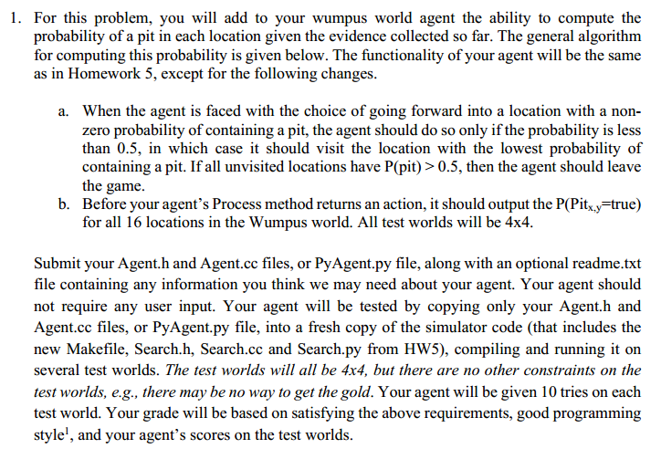
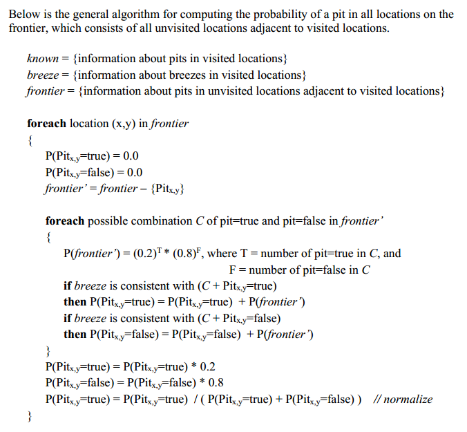

# wumpus_world_search

My solution:
1. The agent looks for the location with lowest probability of pit. If the probability of pit is < 0.5 then only it moves forward.
2. On the way it keeps a check for glitter and also updates safe and unsafe locations around based on the percept.
3. If there are no locations left to travel with probability<0.5 it climbs out. If in the previous try it wasn't able to kill wumpus and climbed out then it goes to the stench location and kills the wumpus.
4. Finally when gold is found it goes back to 1,1 and climbs out.
5. In the next try when the gold has been found it just travels to the goal node directly as it knows the safe path to reach the gold. On the way if wumpus comes in the way it kills it.
